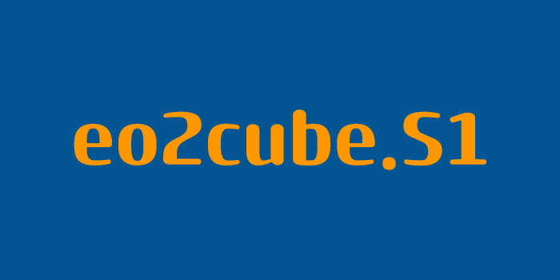
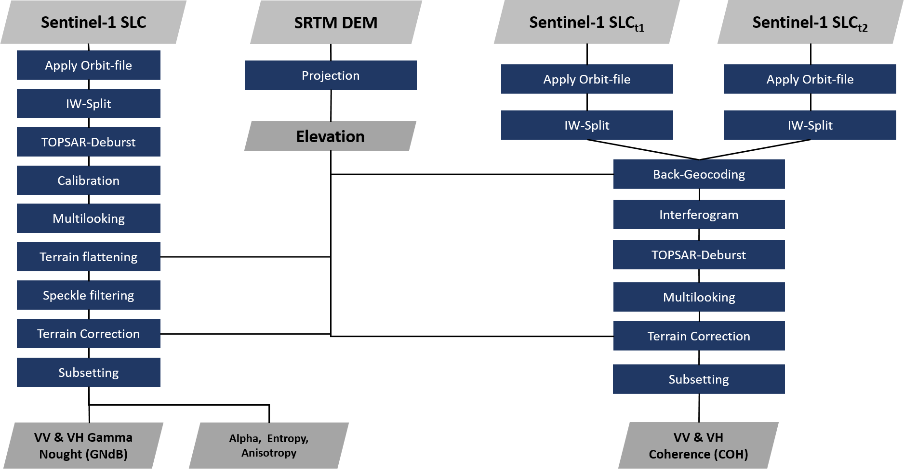

<!-- Improved compatibility of back to top link: See: https://github.com/othneildrew/Best-README-Template/pull/73 -->
<a id="readme-top"></a>
<!--
*** Thanks for checking out the Best-README-Template. If you have a suggestion
*** that would make this better, please fork the repo and create a pull request
*** or simply open an issue with the tag "enhancement".
*** Don't forget to give the project a star!
*** Thanks again! Now go create something AMAZING! :D
-->


<!-- PROJECT SHIELDS -->
<!--
*** I'm using markdown "reference style" links for readability.
*** Reference links are enclosed in brackets [ ] instead of parentheses ( ).
*** See the bottom of this document for the declaration of the reference variables
*** for contributors-url, forks-url, etc. This is an optional, concise syntax you may use.
*** https://www.markdownguide.org/basic-syntax/#reference-style-links
-->
[![Contributors][contributors-shield]][contributors-url]
[![Forks][forks-shield]][forks-url]
[![Issues][issues-shield]][issues-url]
[![MIT License][license-shield]][license-url]


<!-- PROJECT LOGO -->
<br />
<div align="center">
  <a href="https://github.com/eo2cube/s1_processor">
    
  </a>

  <h3 align="center">Sentinel-1 SLC processor for Backscatter, H/alpha and InSAR coherence </h3>

  <p align="center">
    A Sentinel-1 processor based on <a href = "https://step.esa.int/main/download/snap-download"> ESA SNAP </a> and <a href = "https://github.com/johntruckenbrodt/pyroSAR"> pyroSAR </a> for SLC data producing backscatter intensity and/or InSAR coherence and/or Dual pol H/a decomposition.
    <br />
    <a href="https://github.com/othneildrew/Best-README-Template"><strong>Explore the docs »</strong></a>
    <br />
    <br />
    <a href="https://github.com/eo2cube/s1_processor/issues/new?labels=bug&template=bug-report---.md">Report Bug</a>
    ·
    <a href="https://github.com/eo2cube/s1_processor/issues/new?labels=enhancement&template=feature-request---.md">Request Feature</a>
  </p>
</div>


<!-- TABLE OF CONTENTS -->
<details>
  <summary>Table of Contents</summary>
  <ol>
    <li>
      <a href="#about-the-project">About The Project</a>
      <ul>
        <li><a href="#built-with">Built With</a></li>
      </ul>
    </li>
    <li>
      <a href="#getting-started">Getting Started</a>
      <ul>
        <li><a href="#prerequisites">Prerequisites</a></li>
        <li><a href="#installation">Installation</a></li>
      </ul>
    </li>
    <li><a href="#usage">Usage</a></li>
    <li><a href="#roadmap">Roadmap</a></li>
    <li><a href="#contributing">Contributing</a></li>
    <li><a href="#license">License</a></li>
    <li><a href="#contact">Contact</a></li>
    <li><a href="#acknowledgments">Acknowledgments</a></li>
  </ol>
</details>


<!-- ABOUT THE PROJECT -->
## About The Project

[![Product Name Screen Shot][product-screenshot]](https://eo2cube.org/projects/demmin/)

This processing chain is based on the [pyroSAR](https://github.com/johntruckenbrodt/pyroSAR) package. It is capable of distinguishing between ascending and descending orbit and can handle multiple relative orbits.
By default, it creates scenes for each selected polarisation and feature (backscatter intensity, InSAR coherence, Dual pol H/a decomposition).
Mosaicking images from several relative orbits has to be done manually.
The backscatter intensity images are geometrically and radiometrically terrain corrected at gamma nought (Ullmann et al. 2019a, 2019b). The output is either linear or dB.
There is also the possibility to process individual bursts and subswaths.  
Currently, there are still issues with certain projections/ EPSG-codes that SNAP cannot handle properly.




<p align="right">(<a href="#readme-top">back to top</a>)</p>


### Built With


* [![ESA SNAP][ESA SNAP]][ESA SNAP-url]
* [![PyroSAR][PyroSAR]][PyroSAR-url]

<p align="right">(<a href="#readme-top">back to top</a>)</p>


<!-- GETTING STARTED -->
## Getting Started

### Prerequisites

To get started, you first need to [install ESA SNAP](https://step.esa.int/main/download/snap-download/) and pyroSAR ([GitHub](https://github.com/johntruckenbrodt/pyroSAR)), for which the installation guide can be found [here](https://pyrosar.readthedocs.io/en/latest/general/installation.html)

If you want to use the integrated download function, you also need to register at [NASA ASF](https://search.asf.alaska.edu/#/). We opted for ASF to avoid issues with ESA's rolling archive.  

### Installation

1. Clone the repo
   ```sh
   git clone https://github.com/eo2cube/s1_processor.git
   ```
2. Set up your folder structure
   ```sh
   ##code tbd
   ```
3. Run `setup.py`
   ```sh
   ##code tbd
   ```
4. Change git remote url to avoid accidental pushes to base project
   ```sh
   git remote set-url origin github_username/repo_name
   git remote -v # confirm the changes
   ```

<p align="right">(<a href="#readme-top">back to top</a>)</p>


<!-- USAGE EXAMPLES -->
## Usage

_Add example with carbon gaphics_

_For more examples, please refer to the [Documentation](https://example.com)_

<p align="right">(<a href="#readme-top">back to top</a>)</p>


<!-- ROADMAP -->
## Roadmap

- [ ] Check for potential compability issues with ESA SNAP v11
- [ ] Add License
- [ ] Create readthedocs.io


See the [open issues](https://github.com/eo2cube/s1_processor/issues) for a full list of proposed features (and known issues).

<p align="right">(<a href="#readme-top">back to top</a>)</p>


<!-- CONTRIBUTING -->
## Contributing

Contributions are what make the open source community such an amazing place to learn, inspire, and create. Any contributions you make are **greatly appreciated**.

If you have a suggestion that would make this better, please fork the repo and create a pull request. You can also simply open an issue with the tag "enhancement".
Don't forget to give the project a star! Thanks again!

1. Fork the Project
2. Create your Feature Branch (`git checkout -b feature/AmazingFeature`)
3. Commit your Changes (`git commit -m 'Add some AmazingFeature'`)
4. Push to the Branch (`git push origin feature/AmazingFeature`)
5. Open a Pull Request

### Top contributors:

<a href="https://github.com/eo2cube/s1_processor/graphs/contributors">
  
</a>

<p align="right">(<a href="#readme-top">back to top</a>)</p>


<!-- LICENSE -->
## License

Distributed under the MIT License. See `LICENSE.txt` for more information.

<p align="right">(<a href="#readme-top">back to top</a>)</p>


## References
Ullmann, T., Sauerbrey, J., Hoffmeister, D., May, S.M., Baumhauer, R., Bubenzer, O., 2019a. Assessing spatiotemporal variations of sentinel-1 InSAR coherence at different time scales over the atacama desert (Chile) between 2015 and 2018. Remote Sens. 11, 1–22. https://doi.org/10.3390/rs11242960

Ullmann, T., Serfas, K., Büdel, C., Padashi, M., Baumhauer, R., 2019b. Data Processing, Feature Extraction, and Time-Series Analysis of Sentinel-1 Synthetic Aperture Radar (SAR) Imagery: Examples from Damghan and Bajestan Playa (Iran). Zeitschrift für Geomorphol. Suppl. Issues 62, 9–39. https://doi.org/10.1127/zfg_suppl/2019/0524

<!-- CONTACT -->
## Contact

Johannes Löw - agrisens.datacube@uni-wuerzburg.de </br>
Steven Hill - eo2cube@gmail.com

Project Link: [https://github.com/eo2cube/s1_processor](https://github.com/eo2cube/s1_processor)

<p align="right">(<a href="#readme-top">back to top</a>)</p>


<!-- ACKNOWLEDGMENTS -->
## Acknowledgments

* [ESA Copernicus Open Access Hub](https://scihub.copernicus.eu/)
* [NASA Alaskan Satellite Fasility Vertex](https://search.asf.alaska.edu/#/)
* [PyroSAR developers](https://github.com/johntruckenbrodt/pyroSAR)
* [Best-ReadME-Template developers](https://github.com/othneildrew/Best-README-Template)

<p align="right">(<a href="#readme-top">back to top</a>)</p>


<!-- MARKDOWN LINKS & IMAGES -->
<!-- https://www.markdownguide.org/basic-syntax/#reference-style-links -->
[contributors-shield]: https://img.shields.io/badge/contirbutors-StevemHill%20%26%20Jmarkloew-darkblue?style=for-the-badge
[contributors-url]: https://github.com/eo2cube/s1_processor/graphs/contributors
[forks-shield]: https://img.shields.io/badge/Forks%20-1%20-darkorange?style=for-the-badge
[forks-url]:https://github.com/eo2cube/s1_processor/network/members
[stars-shield]: https://img.shields.io/github/stars/othneildrew/Best-README-Template.svg?style=for-the-badge
[stars-url]: https://github.com/othneildrew/Best-README-Template/stargazers
[issues-shield]: https://img.shields.io/badge/Issues%20-Pending-darkblue?style=for-the-badge
[issues-url]: https://github.com/eo2cube/s1_processor/issues
[license-shield]: https://img.shields.io/github/license/othneildrew/Best-README-Template.svg?style=for-the-badge
[license-url]: https://github.com/othneildrew/Best-README-Template/blob/master/LICENSE.txt
[linkedin-shield]: https://img.shields.io/badge/-LinkedIn-black.svg?style=for-the-badge&logo=linkedin&colorB=555
[linkedin-url]: https://linkedin.com/in/othneildrew
[product-screenshot]: 20210320_VH_VH_CR_false_color_comp_example_banner(1).png
[ESA SNAP]: https://img.shields.io/badge/ESA%20SNAP-blue?style=for-the-badge
[ESA SNAP-url]: https://eo4society.esa.int/resources/snap/
[PyroSAR]: https://img.shields.io/badge/python-pyroSAR-darkorange?style=for-the-badge
[PyroSAR-url]: https://github.com/johntruckenbrodt/pyroSAR


